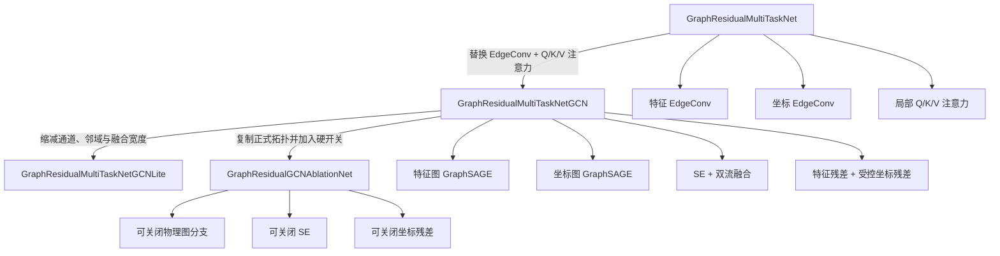
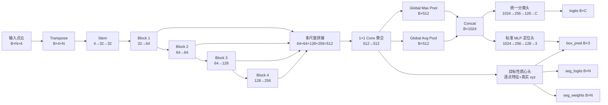
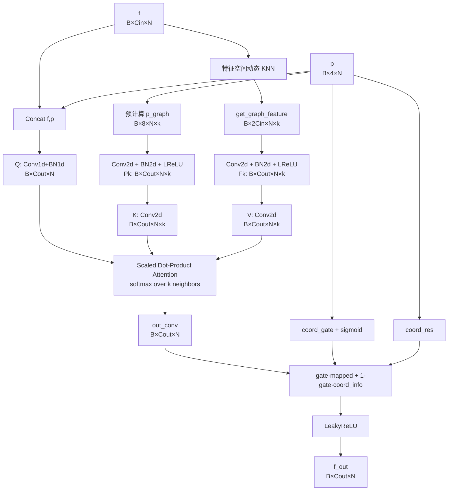
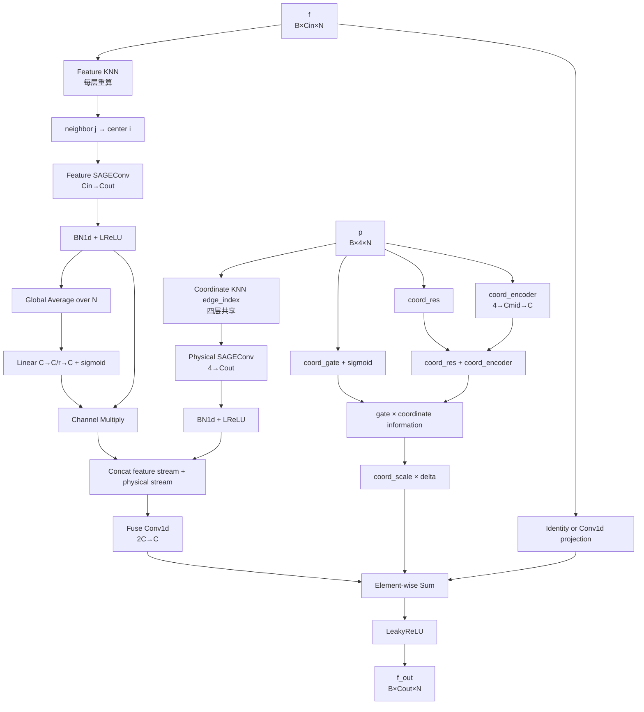
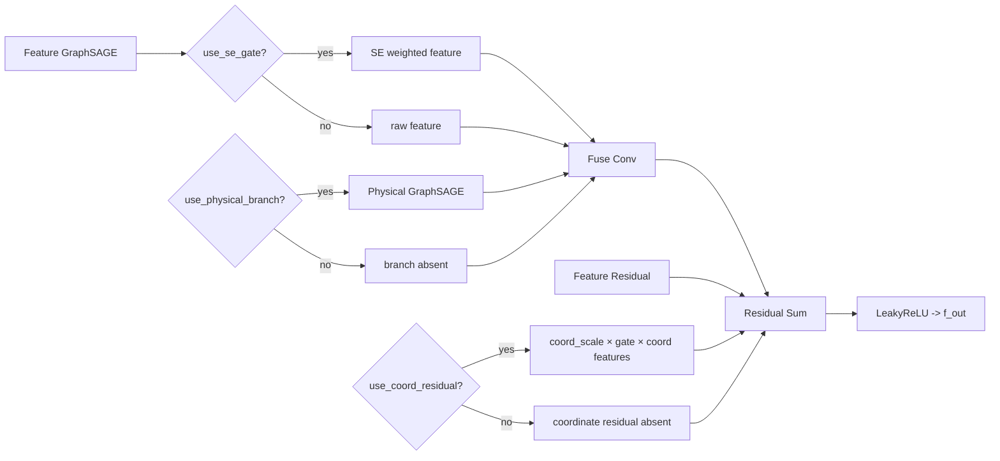
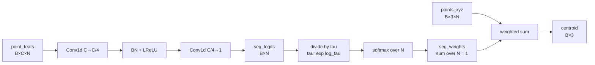

# SPAD 分类定位模型、网络结构与实验配置说明

> 文档日期：2026-07-20  
> 项目根目录：`D:\PYproject\SPAD`  
> 固定 Python：`D:\Anaconda3\envs\torchnew\python.exe`  
> 适用任务：单光子三维点云的字母分类与三维目标中心定位  
> 本文档严格依据当前仓库代码编写；结构图使用可编辑的 Mermaid 文本，并提供 ASCII 线条图作为不支持 Mermaid 的编辑器回退。

---

## 1. 文档范围与代码来源

本文档总结以下内容：

1. `scripts/train.py` 当前注册的所有模型；
2. 自建 `GraphResidual` 系列模型的逐层结构与数据流；
3. 标准 MLP 定位头与目标性质心定位头；
4. 分类、中心定位与逐点目标性辅助损失；
5. 当前训练、验证、测试和 checkpoint 配置；
6. A0--A3 头部消融与 GraphResidual-GCN 结构消融的正确使用方式。

关键代码文件：

| 功能 | 文件 |
|---|---|
| 训练入口、模型注册、训练循环 | `scripts/train.py` |
| 测试入口 | `scripts/test.py` |
| 原始 EdgeConv + 注意力自建网络 | `model/graph_residual.py` |
| GraphSAGE 自建网络与 Lite 版本 | `model/graph_res_GCN.py` |
| 隔离的结构消融网络 | `model/graph_res_GCN_ablation.py` |
| 统一分类头、MLP 定位头、质心头 | `utils/heads.py` |
| 多任务损失 | `utils/loss.py` |
| 数据发现、归一化、划分与 DataLoader | `utils/data.py` |
| checkpoint 保存/加载 | `utils/checkpoint.py` |
| 消融训练母版 | `model/ablation_training_master_plan.md` |
| 消融唯一注册表 | `scripts/ablation_registry.py` |
| GraphSAGE/EdgeCNN 自动分析 | `scripts/analyze_gcn_vs_edge_cnn.py` |
| 19 小时队列 | `scripts/run_ablation_training_19h.py` |

本次文档对应的关键文件 SHA256：

```text
16C6F17F4BE60DE3CE199E594B1937B588DA43BB10C352507F12FF60C08401C4  scripts/train.py
C0C024E139A3375BE6F9BA254403A8CE175E5A90E276D88A8E6563C3399BB967  scripts/test.py
2D7D49F0ACAB0F93F53BB1D9513C242D3D3F1E6E67E22B7FAD59BACDE2426454  model/graph_residual.py
6395A3799C3E6FE1EDAA076DABBAF4A1271E1A423B6AD0517F471CB087688006  model/graph_res_GCN.py
3BC083D2100F3AA64D7E1B95F1524AF9ED8996AC188CFAC62A2C84C698E06E8A  model/graph_res_GCN_ablation.py
A1E0039873FABF0AC05854785F885C568B8EC3AA7C92A1381D6A7CCEA8CFF1E0  scripts/ablation_registry.py
5D19091920A13D21833179EDC569EEFCEBDC8393A895F78F4297C53BEA0FCF9F  scripts/analyze_gcn_vs_edge_cnn.py
C9DB418D54F97256E31E3777FD77FAA7F23DB37D13B1E5643BF1B2004AF0463F  utils/heads.py
A6ABA50DACBD4A4CCE95D05CF7F5220A12FBB99B84F238BF845410344482C95B  utils/loss.py
CC2164B08975C35CEFC94303542D08C199465943770616A6F13EA1B66891F778  utils/data.py
```

后续代码发生变化时，应同时更新本文档和上述 hash，避免论文描述与实际训练代码不一致。

---

## 2. 任务与张量契约

### 2.1 输入点云

训练入口接受两种布局，并通过 `prepare_model_inputs()` 统一为第一种：

```text
标准输入：    points = (B, N, 4)
兼容输入：    points = (B, 4, N)
模型实际输入：points = (B, N, 4)
```

最后一维为：

```text
[x, y, z, intensity]
```

当前正式训练使用：

```text
N = 1024
```

数据归一化范围来自 `utils/data.py`：

```text
x physical range: [1, 64]
y physical range: [1, 64]
z physical range: [1, 110]
```

归一化后，`x/y/z/intensity` 均被限制到 `[0,1]`。

### 2.2 标签与 DataLoader 输出

`collate_fn()` 输出：

```text
points: (B, N, 4)

targets = {
    "bbox_targets": (B, M, 6),  # xmin,xmax,ymin,ymax,zmin,zmax
    "cls_targets":  (B, M),     # 类别索引
    "mask":         (B, M),     # 有效目标掩码
}
```

当前训练循环按“单样本单目标”方式选择每个样本的第一个有效目标，得到：

```text
labels:      (B_valid,)
box_targets: (B_valid, 6)
points:      (B_valid, N, 4)
```

### 2.3 模型输出兼容格式

`utils/loss.py::split_cls_and_box_predictions()` 支持：

```text
Tensor                 -> logits，无 box
Tuple/List             -> (logits, box_pred, ...)
Dict logits keys       -> logits / cls_logits / class_logits / pred_logits
Dict box keys          -> boxes / pred_boxes / bbox / bbox_pred / box_pred
```

自建模型统一返回字典。

MLP 定位头输出：

```python
{
    "logits":   Tensor[B, C],
    "box_pred": Tensor[B, 3],
}
```

质心定位头输出：

```python
{
    "logits":      Tensor[B, C],
    "box_pred":    Tensor[B, 3],
    "seg_logits":  Tensor[B, N],
    "seg_weights": Tensor[B, N],
}
```

`box_pred` 的三个分量为归一化中心坐标：

```text
[cx, cy, cz]
```

---

## 3. 当前可选模型

`scripts/train.py --model` 当前支持以下模型。

| CLI 名称 | 类/构造函数 | 源文件 | 类型 |
|---|---|---|---|
| `dgcnn` | `DGCNNCls` | `baseline/DGCNN.py` | DGCNN baseline |
| `pointnet` | `PointNetCls` | `baseline/pointnet.py` | PointNet baseline |
| `pointnet2` | `PointNet2ClassificationSSG` | `baseline/PointNet++.py` | PointNet++ SSG |
| `pointnet2msg` | `PointNet2ClassificationMSG` | `baseline/PointNet++.py` | PointNet++ MSG |
| `pointtransformer` | `PointTransformerClassification` | `baseline/PointTransformer.py` | Point Transformer |
| `pointtransv2` | `PointTransV2Classification` | `baseline/PointTransV2.py` | Point Transformer V2 |
| `pointtransv3` | `PointTransV3Classification` | `baseline/PointTransV3.py` | Point Transformer V3 |
| `pointmlp` | `PointMLPClassification` | `baseline/PointMLP.py` | PointMLP |
| `pointmlpelite` | `PointMLPClassification(..., variant="pointmlpelite")` | `baseline/PointMLP.py` | PointMLP Elite |
| `pointbert` | `PointBERTClassification` | `baseline/PointBERT.py` | Point-BERT |
| `pointmae` | `PointMAEClassification` | `baseline/PointMAE.py` | Point-MAE |
| `pointrwkv` | `PointRWKVClassification` | `baseline/PointRWKV.py` | PointRWKV |
| `spt` | `SPTNet` | `baseline/SPT.py` | 脉冲 Point Transformer |
| `upp` | `UPPClassification` | `baseline/UPP.py` | UPP baseline |
| `3detr` | `ThreeDETRClassification` | `baseline/3DETR.py` | 3DETR baseline |
| `graph_residual` | `GraphResidualMultiTaskNet` | `model/graph_residual.py` | 自建 EdgeConv + 注意力网络 |
| `graph_residual_gcn` | `GraphResidualMultiTaskNetGCN` | `model/graph_res_GCN.py` | 自建双图 GraphSAGE 网络 |
| `graph_residual_gcn_lite` | `GraphResidualMultiTaskNetGCNLite` | `model/graph_res_GCN.py` | 自建轻量 GraphSAGE 网络 |
| `graph_residual_gcn_ablation` | `GraphResidualGCNAblationNet` | `model/graph_res_GCN_ablation.py` | 隔离的结构消融网络 |

注意：

- `--box-head` 只对自建 `graph_residual*` 系列产生结构影响；
- baseline 不构造 `SegmentationCentroidHead`；
- baseline 即使收到 `--box-head centroid`，训练代码也会把有效头记录为 `mlp`；
- baseline 没有 `seg_logits`，有效 `seg_loss_weight` 必须为 0。

### 3.1 SPT 当前构造配置

`SPTNet` 从 `scripts/train.py` 接收：

| 参数 | 默认值 |
|---|---:|
| `num_point` | 1024 |
| `nblocks` | 4 |
| `nneighbor` | 16 |
| `blocks` | `[1] * (nblocks + 1)` |
| `num_samples` | 512 |
| `spike_mode` | `lif` |
| `timestep` | 2 |
| `use_encoder` | true |
| `transformer_dim` | 512 |
| `use_moe_lif` | true |
| `input_dim` | 4 |

---

## 4. 自建模型家族关系



ASCII 回退图：

```text
GraphResidualMultiTaskNet
  |-- 特征 EdgeConv
  |-- 坐标 EdgeConv
  `-- 局部 Q/K/V 注意力 + 坐标门控
                 |
                 | 替换消息传递与融合结构
                 v
GraphResidualMultiTaskNetGCN
  |-- 特征动态图 GraphSAGE
  |-- 坐标静态图 GraphSAGE
  |-- SE + 双流融合
  `-- feature residual + controlled coordinate residual
          |                              |
          | 轻量化                       | 增加硬开关
          v                              v
GraphResidualMultiTaskNetGCNLite    GraphResidualGCNAblationNet
```

---

## 5. 自建网络公共外层结构

`graph_residual`、`graph_residual_gcn` 与全开配置的 `graph_residual_gcn_ablation` 采用以下 full-width 多任务结构。`graph_residual_gcn_lite` 的数据流拓扑相同，但第 4 个 block、聚合通道和 pooled 维度更小，具体数值见第 8 节。



其中：

- `graph_residual`、`graph_residual_gcn` 和完整消融模型的 block 通道为 `(64,64,128,256)`；
- 多尺度拼接维度为 512；
- 聚合后逐点特征为 `(B,512,N)`；
- max/avg 拼接后的全局特征为 `(B,1024)`；
- 全程不下采样，点数保持 `N=1024`。

ASCII 线条图：

```text
Input (B,N,4)
      |
      v
Transpose (B,4,N)
      |
      v
Stem: Conv1d 4->32 -> BN -> LReLU -> Conv1d 32->32 -> BN -> LReLU
      |
      +------------------------+
      v                        |
Block1 32->64 ---- f1 ---------+
      |
      v
Block2 64->64 ---- f2 ---------+----> Cat[f1,f2,f3,f4] = (B,512,N)
      |                        |
      v                        |              |
Block3 64->128 --- f3 ---------+              v
      |                                   Agg Conv1d 512->512
      v                                        |
Block4 128->256 -- f4 ---------+               +-----------------------+
                                               |                       |
                                               v                       v
                                         MaxPool(B,512)          AvgPool(B,512)
                                               |                       |
                                               +----------+------------+
                                                          |
                                                          v
                                                   Pooled (B,1024)
                                                          |
                                    +---------------------+---------------------+
                                    |                                           |
                                    v                                           v
                         Classification MLP                            Standard Box MLP
                         1024->256->128->C                            1024->256->128->3

Agg point features (B,512,N) + xyz (B,3,N)
                    |
                    `----> SegmentationCentroidHead ----> centroid(B,3)
                                                    `----> seg_logits(B,N)
```

---

## 6. `graph_residual`：EdgeConv + 局部注意力版本

### 6.1 Block 输入

每个 `GraphResidualBlock` 接收：

```text
p:       (B, 4, N)          原始归一化 xyzi
f:       (B, C_in, N)       当前点特征
p_graph: (B, 8, N, k)       预计算坐标 EdgeConv 图特征
```

坐标 `p` 在四个 block 之间保持不变，因此：

```text
knn_gpu(p) + get_graph_feature(p)
```

只在网络入口计算一次，四个 block 共享 `p_graph`。

### 6.2 Block 数据流



对应计算关系：

```text
特征图： f_graph = [f_j - f_i, f_i]
坐标图： p_graph = [p_j - p_i, p_i]

Q = Wq([f, p])
K = Wk(Pk)
V = Wv(Fk)

score(i,j) = <Q_i, K_ij> / sqrt(C_out)
weight(i,j) = softmax_j(score(i,j))
attention_i = sum_j weight(i,j) * V_ij

mapped = out_conv(attention)
gate = sigmoid(coord_gate(p))
coord_info = coord_res(p)
f_out = LeakyReLU(gate * mapped + (1-gate) * coord_info)
```

### 6.3 参数配置

| 参数 | 默认值 |
|---|---:|
| `k` | 20 |
| `use_checkpoint` | true |
| `dropout` | 0.3 |
| `box_dim` | 3 |
| `seg_centroid_box` | true |
| block 通道 | 64, 64, 128, 256 |
| 下采样 | false |

参数量：

| 定位头 | 参数量 |
|---|---:|
| 质心头 | 1,057,564 |
| 标准 MLP 头 | 1,287,837 |

---

## 7. `graph_residual_gcn`：当前默认自建网络

当前 `scripts/train.py` 的默认模型为：

```text
graph_residual_gcn
```

它使用 PyTorch Geometric `SAGEConv` 替换原始 EdgeConv，并使用 SE 与残差融合替换局部 Q/K/V 注意力。

### 7.1 图构建

#### 坐标图

```text
输入：p = (B,4,N)
KNN：按 xyzi 特征计算
默认：排除中心点自身
状态：网络入口预计算一次，四个 block 共用
```

#### 特征图

```text
输入：当前层 f = (B,C,N)
KNN：每个 block 重新计算
作用：形成随语义特征更新的动态图
```

#### PyG 边方向

`batched_knn_edge_index()` 构建：

```text
neighbor/source j  --->  center/target i
```

这与 PyG 默认 `source_to_target` 消息流一致，使中心点 `i` 聚合其 KNN 邻居 `j`。

### 7.2 SAGEConv

每个 `BatchedSAGEConv` 将：

```text
(B,C,N) -> (B*N,C) -> SAGEConv -> (B*N,Cout) -> (B,Cout,N)
```

概念公式：

```text
h_i' = W_root h_i + W_neighbor AGG({h_j | j in N(i)})
```

当前聚合器可选：

```text
max
mean
```

默认使用 `max`。

### 7.3 单个 GCN Block 结构



严格对应非 legacy 前向：

```text
f_gcn = LReLU(BN(SAGE_f(f, feature_edges)))
p_gcn = LReLU(BN(SAGE_p(p, coordinate_edges)))

se_weight = sigmoid(SE(mean_N(f_gcn)))
f_gcn_gated = f_gcn * se_weight

fused = fuse_conv(concat(f_gcn_gated, p_gcn))
feature_skip = projection(f) 或 f

coord_gate = sigmoid(coord_gate(p))
coord_delta = coord_gate * (coord_res(p) + coord_encoder(p))

f_out = LReLU(fused + feature_skip + coord_scale * coord_delta)
```

### 7.4 全网通道

```text
Input:      (B,N,4)
Transpose:  (B,4,N)
Stem:       4 -> 32 -> 32
Block1:     32 -> 64
Block2:     64 -> 64
Block3:     64 -> 128
Block4:     128 -> 256
Concat:     64+64+128+256 = 512
Agg:        512 -> 512
Max+Avg:    512+512 = 1024
Cls head:   1024 -> 256 -> 128 -> num_classes
Box MLP:    1024 -> 256 -> 128 -> 3
Centroid:   point feature 512 -> 128 -> 1 -> weighted xyz
```

### 7.5 默认配置

| 参数 | 默认值 | CLI |
|---|---:|---|
| KNN 邻居数 | full 默认 20 | `--gcn-k` |
| 聚合器 | `max` | `--gcn-aggregation` |
| 排除自身 | true | `--gcn-exclude-self` |
| feature residual | true | `--gcn-feature-residual` |
| coord scale 初值 | 0.1 | `--gcn-coord-scale-init` |
| 梯度检查点 | true | `--gcn-use-checkpoint` |
| legacy mode | false | `--gcn-no-legacy-mode` |
| block 通道 | 64,64,128,256 | 代码固定 |
| agg 通道 | 512 | 代码固定 |
| SE ratio | 4 | 代码固定 |
| fuse bottleneck ratio | 1 | 代码固定 |
| coord mid ratio | 1 | 代码固定 |

参数量：

| 定位头 | 参数量 |
|---|---:|
| 质心头 | 1,101,472 |
| 标准 MLP 头 | 1,331,745 |

### 7.6 Legacy 模式

`--gcn-legacy-mode` 仅用于复现旧 checkpoint。代码会：

1. 翻转 `edge_index`；
2. 使用旧坐标融合逻辑；
3. 不使用当前显式 feature residual 与可学习 coord scale 的非 legacy 组合方式。

新实验应明确使用：

```text
--gcn-no-legacy-mode
```

---

## 8. `graph_residual_gcn_lite`：轻量版本

Lite 版本继承完整 GCN 网络，修改以下配置：

| 项目 | Full | Lite |
|---|---:|---:|
| 默认 KNN `k` | 20 | 16 |
| block 通道 | 64,64,128,256 | 64,64,128,192 |
| 拼接通道 | 512 | 448 |
| agg 通道 | 512 | 384 |
| pooled 维度 | 1024 | 768 |
| SE ratio | 4 | 8 |
| fuse bottleneck ratio | 1 | 4 |
| coord mid ratio | 1 | 2 |

Lite 数据流：

```text
(B,N,4)
   |
   v
Stem 4->32
   |
   v
32->64 -> 64->64 -> 64->128 -> 128->192
   |         |          |           |
   +---------+----------+-----------+
                     |
                     v
             Cat = 448 channels
                     |
                     v
             Agg Conv 448->384
                     |
                     v
        MaxPool 384 + AvgPool 384
                     |
                     v
               pooled = 768
```

参数量：

| 定位头 | 参数量 |
|---|---:|
| 质心头 | 665,440 |
| 标准 MLP 头 | 858,945 |

---

## 9. `graph_residual_gcn_ablation`：结构消融网络

该文件是独立的新模型文件：

```text
model/graph_res_GCN_ablation.py
```

目的：不修改正式 `graph_res_GCN.py`，通过真正不构造相应模块的方式完成结构消融。

### 9.1 完整模式

当以下三项均开启时：

```text
gcn_use_physical_branch = true
gcn_use_se_gate = true
gcn_use_coord_residual = true
gcn_operator = sage
```

其：

- 参数量与正式 GCN 一致；
- `state_dict` key 和 tensor shape 与正式 GCN 一致；
- block 数据流与非 legacy 正式 GCN 一致。

因此可用于 A1--A3 的隔离训练，也可作为结构消融参照 B0。

### 9.2 三个硬开关

#### 关闭物理图分支

```powershell
--gcn-no-physical-branch
```

变化：

```text
删除：gcn_p
删除：bn_p
删除：坐标图 SAGEConv 前向
融合输入：concat(feature, physical) 改为 feature only
fuse_conv 输入通道：2*Cout 改为 Cout
```

数据流：

```text
feature graph -> SAGEConv -> optional SE -> fuse_conv -> residual sum

coordinate graph branch: REMOVED
```

#### 关闭 SE

```powershell
--gcn-no-se-gate
```

变化：

```text
删除：SE 两层 Linear 与 sigmoid
特征流：f_gcn 直接进入双流融合
```

数据流：

```text
feature SAGEConv --------------------------+
                                             +--> concat --> fuse_conv
physical SAGEConv -------------------------+
```

#### 关闭坐标残差

```powershell
--gcn-no-coord-residual
```

变化：

```text
删除：coord_gate
删除：coord_res
删除：coord_encoder
删除：coord_scale Parameter
输出：LReLU(fused + feature_skip)
```

### 9.3 消融结构总图



### 9.4 参数量

为保证结构消融时统一使用 MLP 定位头，下面列出 MLP 头配置：

| 配置 | 参数量 |
|---|---:|
| 完整结构 | 1,331,745 |
| 无物理图分支 | 1,236,001 |
| 无 SE | 1,286,689 |
| 无坐标残差 | 1,231,389 |

除上述三个新硬开关外，已有 CLI 还可完成：

| 消融 | CLI |
|---|---|
| max 改 mean | `--gcn-aggregation mean` |
| KNN 保留自身 | `--gcn-include-self` |
| 关闭 feature residual | `--gcn-no-feature-residual` |
| 改变 coord scale 初值 | `--gcn-coord-scale-init <value>` |

结构归因实验统一建议：

```text
box_head = mlp
effective seg loss weight = 0
```

避免把骨干、定位头和辅助监督同时改变。

### 9.5 参数匹配的 GraphSAGE / EdgeCNN 算子对照

新增 `--gcn-operator {sage,edge_cnn}`，只对 `graph_residual_gcn_ablation` 生效：

```text
sage:
    h_i = W_root x_i + W_neighbor AGG(x_j)

edge_cnn:
    m_ji = W_edge [x_j - x_i, x_i] + b
    h_i = AGG(m_ji)
```

EdgeCNN 的 `Linear(2*Cin,Cout)` 与同通道 SAGEConv 参数量完全一致。B0 与 B8 的完整 MLP-head 模型均为 `1,331,745` 参数，并保持以下因素不变：

- 相同动态特征 KNN 和静态坐标 KNN；
- 相同 max/mean 聚合选择；
- 相同双分支、SE 和 fusion；
- 相同 feature residual 与 coordinate residual；
- 相同分类/定位头和训练协议。

因此 `B8-B0` 专门回答 GraphSAGE 消息传递相对 CNN 式 edge MLP 的增量，不与“多一条分支”或“更多参数”混淆。自动分析：

```powershell
& $SPAD_PYTHON scripts\analyze_gcn_vs_edge_cnn.py
```

---

## 10. 分类头和定位头

### 10.1 统一分类头

来自 `build_standard_cls_head()`：

```text
pooled
  |
  v
Linear(pooled -> 256, bias=False)
  |
BN1d -> LeakyReLU(0.2) -> Dropout(0.3)
  |
  v
Linear(256 -> 128)
  |
BN1d -> LeakyReLU(0.2) -> Dropout(0.3)
  |
  v
Linear(128 -> num_classes)
  |
  v
logits (B,C)
```

### 10.2 标准 MLP 定位头

来自 `build_standard_box_head()`：

```text
pooled
  |
  v
Linear(pooled -> 256, bias=False)
  |
BN1d -> LeakyReLU(0.2) -> Dropout(0.3)
  |
  v
Linear(256 -> 128)
  |
BN1d -> LeakyReLU(0.2)
  |
  v
Linear(128 -> 3)
  |
  v
[cx,cy,cz]
```

注意第二层后没有 Dropout，这一点与分类头不同。

### 10.3 目标性质心头

`SegmentationCentroidHead` 使用逐点特征而不是池化向量。



公式：

```text
s_i = seg_mlp(f_i)
tau = exp(clamp(log_tau))
w_i = softmax_i(s_i / tau)
centroid = sum_i w_i * xyz_i
```

特点：

- `w_i >= 0` 且 `sum_i w_i = 1`；
- 预测中心是输入 xyz 的凸组合；
- `seg_logits` 保留未除以温度的原始值，用于 BCE；
- intensity 不参与最终质心加权，只参与 backbone 特征提取。

---

## 11. 多任务损失

`PointCloudMultiTaskLoss` 的固定权重模式为：

```text
L_total = lambda_cls * L_cls
        + lambda_box * L_soft_histogram
        + lambda_seg_effective * L_seg
```

当前默认：

```text
lambda_cls = 1.0
lambda_box = 10.0
requested lambda_seg = 0.5
```

### 11.1 分类损失

```text
L_cls = CrossEntropy(logits, labels, label_smoothing=0.1)
```

### 11.2 SPAD Soft-histogram 中心损失

GT 六维角点框先转换为中心：

```text
[xmin,xmax,ymin,ymax,zmin,zmax]
                |
                v
             [cx,cy,cz]
```

每个维度使用离散 bin 宽度：

```text
delta_x = 1/63
delta_y = 1/63
delta_z = 1/108
```

代码默认：

```text
K = 2
sigma = 1.5 bins
k in {-2,-1,0,1,2}
```

损失概念式：

```text
L_depth = sum_k w_k * mean_batch(
    ||pred_center - (gt_center + k * delta)||^2
)
```

同时记录：

```text
box_z_mae
box_center_mae
box_iou_mean
```

### 11.3 逐点目标性 BCE

只有同时满足以下条件才计算：

```text
seg_weight > 0
模型输出包含 seg_logits
criterion.forward 收到 points
```

GT 点标签由点是否落入 GT box 生成：

```text
inside GT box -> 1
outside GT box -> 0
```

### 11.4 requested 与 effective 配置

训练代码在模型构造后写入：

```text
requested_box_head
requested_seg_loss_weight
effective_box_head
effective_seg_loss_weight
```

有效规则：

```text
model.seg_centroid_box == true:
    effective_box_head = centroid
    effective_seg_loss_weight = requested_seg_loss_weight

otherwise:
    effective_box_head = mlp
    effective_seg_loss_weight = 0
```

因此：

| 模型/头 | requested seg | effective seg |
|---|---:|---:|
| baseline | 任意 | 0 |
| 自建 + MLP | 任意 | 0 |
| 自建 + centroid | 0 | 0 |
| 自建 + centroid | 0.5 | 0.5 |

---

## 12. 当前训练默认配置

直接运行 `scripts/train.py` 不传参数时的默认值：

| 类别 | 参数 | 默认值 |
|---|---|---:|
| 数据 | `data_root` | `D:\PYproject\SPADdata\2025-04-30-dpc` |
| 模型 | `model` | `graph_residual_gcn` |
| 训练 | `epochs` | 100 |
| 训练 | `batch_size` | 32 |
| 训练 | `grad_accum_steps` | 1 |
| 数据 | `num_aug` | 3 |
| 数据 | `num_points` | 1024 |
| 优化 | `lr` | 0.001 |
| 优化 | `min_lr` | 0.00001 |
| 优化 | `weight_decay` | 0.0001 |
| 划分 | train/val/test | 0.6 / 0.2 / 0.2 |
| DataLoader | `num_workers` | 0 |
| 随机 | `seed` | 42 |
| 设备 | `device` | `cuda` |
| 标签 | `label_mode` | `raw` |
| 损失 | `cls_loss_weight` | 1.0 |
| 损失 | `box_loss_weight` | 10.0 |
| 损失 | `auto_balance` | false |
| 损失 | `label_smoothing` | 0.1 |
| 定位头 | `box_head` | `centroid` |
| 辅助监督 | `seg_loss_weight` | 0.5 |
| EMA | `ema_decay` | 0.0，关闭 |
| AMP | `amp` | false |
| TF32 | `tf32` | false |
| 增强 | `augment_train` | true |
| 增强 | `augment_eval` | true |
| 日志 | `log_dir` | `logs/CLS` |
| checkpoint | `save_dir` | `checkpoints/CLS` |

优化器与调度器：

```text
Optimizer: AdamW
Scheduler: CosineAnnealingLR
T_max: epochs
eta_min: min_lr
```

若启用 `auto_balance`，criterion 中的可学习 Kendall 权重也会加入 optimizer。

---

## 13. 数据划分与增强

当前 `create_dataloaders()` 的行为：

1. 扫描合法正式窗口文件；
2. `raw` 模式只对有标签样本划分；
3. 优先读取数据根目录下的 `.split_cache.json`；
4. cache fingerprint 匹配时复用其中的路径顺序；
5. cache 缺失或失效时按传入 `seed` 重新划分；
6. 训练集必须启用增强，否则抛出异常；
7. `num_aug` 只扩展训练集；
8. 验证和测试即使增强也只保留一个视图。

当前母版冻结划分：

```text
Raw train/val/test: 5116 / 1705 / 1705
Train with num_aug=3: 15348
Split cache SHA256:
AB94E67744AC3C73FC45A2D3E3E389773661E3EEBA85A6F8EF2C3025220A9F22
```

重要限制：当前 `utils/data.py` 的 cache 命中逻辑主要校验样本 fingerprint 和 label mode；尚未把比例、split seed 和不可变 manifest hash 全部纳入严格拒绝逻辑。因此正式多 seed 队列使用额外脚本校验固定 cache SHA256。

数据系列边界：用户已确认分类与消融实验使用 `D:\PYproject\SPADdata\2025-04-30-dpc`。`D:\PYproject\SPADdata\20250430\2025-04-30-pc` 是正式三页源点云目录，不能直接与本分类系列混合训练或混表。

---

## 14. Best checkpoint 选择

每个 epoch 计算：

```text
classification_score = clamp(top1, 0, 1)
z_score = 1 / (1 + box_z_mae / depth_scale)
depth_score = 1 / (1 + box_depth_loss / depth_scale)
```

默认：

```text
depth_scale = 0.01
raw weights = 1 : 1 : 1
normalized weights = 1/3 : 1/3 : 1/3
```

组合分数：

```text
val_score = w_cls * classification_score
          + w_z * z_score
          + w_depth * depth_score
```

此分数只用于选择 best checkpoint，不参与反向传播。

如果启用 EMA：

- 验证和 best 选择使用 EMA 影子模型；
- best checkpoint 保存 EMA 权重；
- last checkpoint 保存当前训练模型并附加 EMA 状态。

当前正式消融协议关闭 EMA：

```text
--ema-decay 0.0
```

---

## 15. Checkpoint 内容与恢复

当前 checkpoint 至少保存：

```python
{
    "epoch": ...,
    "model_state_dict": ...,
    "optimizer_state_dict": ...,
    "scheduler_state_dict": ...,
    "criterion_state_dict": ...,
    "best_val_top1": ...,
    "best_val_score": ...,
    "best_val_metrics": ...,
    "score_config": ...,
    "class_to_idx": ...,
    "args": ...,
}
```

启用 EMA 时可额外保存：

```text
ema_state_dict
```

文件名：

```text
<model>_<timestamp>_best.pth
<model>_<timestamp>_last.pth
```

恢复原则：

- 优先 `_last.pth`；
- 从 checkpoint 的 `epoch` 恢复，而不是从日志最后一行推断；
- 同时恢复 optimizer、scheduler、criterion 和 EMA 状态；
- `_best.pth` 只代表最佳验证分数所在 epoch，不一定是训练中断前最后 epoch。

当前 checkpoint 尚未由 `utils/checkpoint.py` 自动写入：

```text
split manifest path/hash
代码 commit/hash
环境摘要
```

这些仍属于 `ablation_training_master_plan.md` 中待完成的 P0 审计增强项。

---

## 16. A0--A3 核心头部消融

固定骨干/头部关系：

| ID | Backbone | 有效定位头 | 有效目标性 BCE | 归因 |
|---|---|---|---:|---|
| A0 | DGCNN | MLP | 0 | baseline 参照 |
| A1 | GraphResidual-GCN | MLP | 0 | A1-A0：骨干整体差异 |
| A2 | GraphResidual-GCN | centroid | 0 | A2-A1：质心参数化贡献 |
| A3 | GraphResidual-GCN | centroid | 0.5 | A3-A2：辅助 BCE 贡献 |

A1--A3 的结构消融参数必须保持全开：

```text
physical branch = true
SE gate = true
coordinate residual = true
feature residual = true
aggregation = max
exclude self = true
```

A2 与 A3 的唯一有效差异应为：

```text
seg_loss_weight: 0.0 -> 0.5
```

---

## 17. 结构消融建议矩阵

所有结构消融固定：

```text
model = graph_residual_gcn_ablation
box_head = mlp
seg_loss_weight = 0
```

执行分层：

| ID | 层级与 seed | 变化 | 命令参数 |
|---|---|---|---|
| B0 | 核心，42/43 | 完整结构；复用同 seed A1 | 三个 `--gcn-use-*` |
| B1 | 核心，42/43 | 无坐标图 GraphSAGE 分支 | `--gcn-no-physical-branch` |
| B2 | 附录，42 | 无 SE | `--gcn-no-se-gate` |
| B3 | 核心，42/43 | 无坐标残差 | `--gcn-no-coord-residual` |
| B4 | 核心，42/43 | mean 聚合 | `--gcn-aggregation mean` |
| B5 | 附录，42 | KNN 包含自身 | `--gcn-include-self` |
| B6 | 核心，42/43 | 无 feature residual | `--gcn-no-feature-residual` |
| B7 | 核心，42/43 | 同时关闭两条显式坐标增强路径 | `--gcn-no-physical-branch --gcn-no-coord-residual` |
| B8 | 算子对照，42/43 | GraphSAGE 改为参数匹配 EdgeCNN | `--gcn-operator edge_cnn` |

目标性权重敏感性固定为 `lambda_obj ∈ {0, 0.25, 0.5, 1.0}`，均使用
seed42/43；其中 0 和 0.5 分别复用 A2/A3，只新增 0.25 与 1.0 的四次训练。

解释限制：

- B1 解释整个坐标 GraphSAGE 分支，不应声称只解释某一层；
- B2 只作为单 seed 附录观察 SE 通道门控，不作核心结论；
- B3 解释 `coord_gate + coord_res + coord_encoder + coord_scale` 整体；
- B4 解释聚合器选择；
- B5 只作为单 seed 附录观察 KNN 是否包含根节点；
- B6 解释显式 feature residual；
- B7 检查两条显式坐标增强路径的合并贡献及可能交互，不能替代 B1/B3 单独比较；
- B8 只改变局部算子，使用 `B8-B0` 分析 GraphSAGE 相对参数匹配 EdgeCNN 的意义；
- 两 seed 只报告逐 seed、mean/std 与 paired delta，不作显著性声明。

截至 2026-07-20，原核心结构完整 checkpoint 覆盖 `7/12`：B1_seed43 已完成，B3_seed43 可从 epoch 93 恢复。B8 EdgeCNN 两 seed已完成代码、GPU smoke 和 dry-run但尚未训练。后续时间表见 [`ablation_training_plan_20260720_10h.md`](ablation_training_plan_20260720_10h.md)。

---

## 18. 训练命令

### 18.1 默认完整 GCN

```powershell
$SPAD_PYTHON = "D:\Anaconda3\envs\torchnew\python.exe"
Set-Location "D:\PYproject\SPAD"

& $SPAD_PYTHON scripts\train.py `
  --data-root "D:\PYproject\SPADdata\2025-04-30-dpc" `
  --model graph_residual_gcn `
  --epochs 100 `
  --batch-size 32 `
  --num-points 1024 `
  --num-aug 3 `
  --box-head centroid `
  --seg-loss-weight 0.5 `
  --gcn-aggregation max `
  --gcn-exclude-self `
  --gcn-feature-residual `
  --gcn-coord-scale-init 0.1 `
  --gcn-use-checkpoint `
  --gcn-no-legacy-mode `
  --no-amp `
  --no-tf32
```

### 18.2 A1：GCN + MLP

```powershell
& $SPAD_PYTHON scripts\train.py `
  --model graph_residual_gcn_ablation `
  --box-head mlp `
  --seg-loss-weight 0 `
  --gcn-use-physical-branch `
  --gcn-use-se-gate `
  --gcn-use-coord-residual
```

### 18.3 A2：GCN + centroid，无 BCE

```powershell
& $SPAD_PYTHON scripts\train.py `
  --model graph_residual_gcn_ablation `
  --box-head centroid `
  --seg-loss-weight 0 `
  --gcn-use-physical-branch `
  --gcn-use-se-gate `
  --gcn-use-coord-residual
```

### 18.4 A3：GCN + centroid + BCE

```powershell
& $SPAD_PYTHON scripts\train.py `
  --model graph_residual_gcn_ablation `
  --box-head centroid `
  --seg-loss-weight 0.5 `
  --gcn-use-physical-branch `
  --gcn-use-se-gate `
  --gcn-use-coord-residual
```

### 18.5 结构消融示例：无物理图分支

```powershell
& $SPAD_PYTHON scripts\train.py `
  --model graph_residual_gcn_ablation `
  --box-head mlp `
  --seg-loss-weight 0 `
  --gcn-no-physical-branch `
  --gcn-use-se-gate `
  --gcn-use-coord-residual
```

### 18.6 B8：参数匹配 EdgeCNN 算子对照

```powershell
& $SPAD_PYTHON scripts\run_ablation_matrix.py `
  --families operator `
  --experiments B8_edge_cnn_seed42,B8_edge_cnn_seed43 `
  --run-tag dry_b8_edge_cnn
```

省略 `--execute` 时只做安全 dry-run。正式训练需用户明确确认。

### 18.7 19 小时限时队列

默认不传 `--execute` 时只进行 dry-run：

```powershell
& $SPAD_PYTHON scripts\run_ablation_training_19h.py
```

正式执行：

```powershell
& $SPAD_PYTHON scripts\run_ablation_training_19h.py `
  --execute `
  --max-hours 18.75 `
  --reserve-hours 0.5
```

---

## 19. 测试与当前限制

正式论文测试建议明确关闭增强：

```powershell
& $SPAD_PYTHON scripts\test.py `
  --data-root "D:\PYproject\SPADdata\2025-04-30-dpc" `
  --checkpoint "<best.pth>" `
  --model auto `
  --batch-size 32 `
  --num-points 1024 `
  --seed 42 `
  --label-mode raw `
  --no-augment-eval `
  --device cuda `
  --box-space normalized
```

当前 `scripts/test.py` 的代码默认值是：

```text
batch_size = 16
augment_eval = true
box_space = absolute
```

因此正式消融测试必须显式传入：

```text
--no-augment-eval
--box-space normalized
```

### 19.1 消融模型测试限制

当前测试 parser 的显式 choices 尚未包含：

```text
graph_residual_gcn_ablation
```

`--model auto` 会因为文件名包含 `graph_residual_gcn` 而将其识别为正式 GCN：

- 对“结构全开”的 ablation checkpoint，state dict 与正式 GCN 一致，可按正式 GCN 加载；
- 对关闭物理分支、SE 或坐标残差的 checkpoint，state dict 已发生变化，不能由正式 GCN 严格加载。

因此在结构消融正式测试前，应为 `scripts/test.py` 增加 ablation 模型显式注册，并从 checkpoint `args` 恢复三个硬开关。本文档只描述当前代码事实，不把该功能写成已经完成。

---

## 20. 训练前验证清单

```text
[ ] 使用 D:\Anaconda3\envs\torchnew\python.exe
[ ] torch.cuda.is_available() == True
[ ] GPU 为 NVIDIA GeForce RTX 4070 SUPER
[ ] split cache SHA256 未变化
[ ] 输入为 (B,N,4)，N=1024
[ ] box 输出为 (B,3)
[ ] A0/A1 effective seg weight = 0
[ ] A2 有 seg_logits，但 effective seg weight = 0
[ ] A3 有 seg_logits，effective seg weight = 0.5
[ ] 结构消融统一使用 MLP head 和 seg weight 0
[ ] 训练验证协议固定，最终测试显式 --no-augment-eval
[ ] smoke 输出目录与正式 checkpoint/log 目录分开
```

固定环境检查：

```powershell
& "D:\Anaconda3\envs\torchnew\python.exe" -c `
  "import torch; print(torch.__version__); print(torch.version.cuda); print(torch.cuda.is_available()); print(torch.cuda.get_device_name(0) if torch.cuda.is_available() else 'CUDA unavailable')"
```

---

## 21. 论文归因边界

可以使用的表述：

```text
A1-A0：GraphResidual-GCN 骨干整体相对 DGCNN 的差异。
A2-A1：分割引导质心参数化相对标准 MLP 定位头的差异。
A3-A2：框监督逐点目标性 BCE 的贡献。
B1-B0：物理坐标图 GraphSAGE 分支整体贡献。
B3-B0：受控坐标残差整体贡献。
B4-B0：max 与 mean 聚合选择的影响。
B6-B0：显式 feature residual 的贡献。
B7-B0：两条显式坐标增强路径的合并贡献。
B2/B5：单 seed 附录观察，不作为核心结构结论。
```

不应使用的过度表述：

```text
A1-A0 不能单独归因于 SAGEConv。
A1-A0 不能单独归因于双图结构。
关闭物理分支不能解释某个单独坐标层的贡献。
coord_scale_init=0 不能视为严格关闭坐标残差，因为参数仍可学习。
MLP + seg_weight=0.5 不能视为有效辅助监督实验，因为没有 seg_logits。
```

---

## 22. Mermaid 图的编辑方式

本文档中的结构图本身就是可编辑文本，无需额外 PPT：

1. 在 VS Code 安装 Markdown Mermaid 预览插件；
2. 直接修改 `mermaid` 代码块中的节点和连线；
3. GitHub、Typora、Obsidian 等支持 Mermaid 的工具可直接渲染；
4. 如需放入论文或答辩 PPT，可从 Mermaid 编辑器导出 SVG；
5. SVG 仍是矢量格式，可在 PowerPoint、Illustrator 或 Inkscape 中继续编辑。

相比把结构图直接保存为位图，Mermaid 与 ASCII 图更容易和代码同步，也更适合版本控制。

---

## 23. 快速定位索引

| 想确认的问题 | 查看位置 |
|---|---|
| 当前有哪些模型 | `scripts/train.py::build_model` 和 `build_parser` |
| GCN Block 如何计算 | `model/graph_res_GCN.py::GraphResidualBlockGCN` |
| 消融模块是否真的删除 | `model/graph_res_GCN_ablation.py::GraphResidualAblationBlockGCN` |
| Full/Lite 通道差异 | `GraphResidualMultiTaskNetGCN` / `GraphResidualMultiTaskNetGCNLite` |
| 质心如何计算 | `utils/heads.py::SegmentationCentroidHead` |
| seg BCE 是否生效 | `utils/loss.py::PointCloudMultiTaskLoss.forward` |
| requested/effective 配置 | `scripts/train.py::run_training` |
| best checkpoint 如何选 | `scripts/train.py::compute_composite_score` |
| checkpoint 保存什么 | `utils/checkpoint.py::save_checkpoint` |
| 数据如何划分 | `utils/data.py::create_dataloaders` |
| 消融编号 | `model/ablation_training_master_plan.md` |

